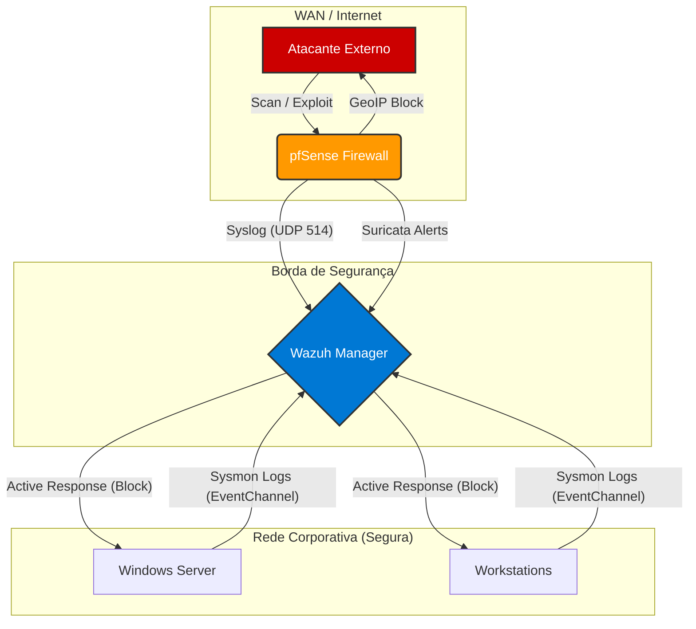

# Implementação de SOC Corporativo: Monitoramento e Defesa Ativa (Wazuh + pfSense)

  

## Sobre o Projeto
Este repositório documenta a implementação técnica e a operação de um **Security Operations Center (SOC)** em **ambiente de produção**. O projeto foi implantado para centralizar a segurança da infraestrutura corporativa, monitorando servidores e estações de trabalho reais.

O foco principal foi a criação de um ambiente robusto e funcional, superando desafios de **tuning** (redução de ruído em rede ativa) e **hardening** da própria infraestrutura de segurança para garantir alta disponibilidade e proteção contra ameaças reais.

## Arquitetura e Tecnologias

| Componente | Tecnologia | Função |
| :--- | :--- | :--- |
| **SIEM / XDR** | Wazuh (v4.x) | Centralização de logs, correlação de eventos e FIM em tempo real. |
| **Firewall / IDS** | pfSense | Defesa de perímetro, IDS (Suricata) e bloqueio GeoIP na borda. |
| **Endpoint** | Sysmon + Wazuh Agent | Telemetria profunda de processos e rede em parque Windows. |
| **Virtualização** | Hyper-V | Hospedagem da infraestrutura de segurança (Ubuntu Server). |

## Implementações de Destaque

### 1. Defesa de Perímetro (Network Security)
Configuração de firewall **pfSense** atuando como gateway de borda da empresa:
- **IDS Suricata:** Inspeção profunda de pacotes (DPI) na interface WAN para detecção de anomalias e tentativas de intrusão.
- **pfBlockerNG:** - *GeoIP Blocking:* Bloqueio de conexões de países sem relação comercial com a empresa (redução drástica de superfície de ataque).
    - *DNSBL:* Sinkhole para domínios maliciosos e de phishing, protegendo usuários internos.
- **Integração:** Forwarding de logs via Syslog (UDP 514) para o Wazuh Manager para correlação centralizada.

### 2. Telemetria Avançada e Tuning (Endpoint Security)
Para superar as limitações dos logs padrão do Windows, foi implementado o **Sysmon** (System Monitor) em todo o parque:
- **Cobertura:** Criação de Processos (ID 1), Conexões de Rede (ID 3), Injeção de DLLs (ID 7) e Consultas DNS (ID 22).
- **Noiseless Approach:** Desenvolvimento de regras de *whitelist* agressivas para softwares corporativos em uso (ERPs, Ferramentas de Dev, Antivírus), eliminando ruído operacional e focando a atenção apenas em incidentes reais.

### 3. Hardening da Aplicação Web
- Implementação de **Autoridade Certificadora (CA) Interna**.
- Geração de certificados SSL/TLS próprios para garantir comunicação HTTPS segura no Dashboard, eliminando avisos de insegurança no navegador e protegendo credenciais de acesso administrativas.

### 4. Defesa Ativa (Active Response)
Automação de resposta a incidentes de severidade crítica (Nível > 10):
- **Gatilho:** Detecção de ataques de força bruta ou scans agressivos direcionados aos servidores.
- **Ação:** Bloqueio temporário do IP atacante via firewall local (`netsh`) no Windows.
- **Segurança:** Whitelist de IPs de gestão para prevenir bloqueio acidental da equipe de TI.

## Estrutura dos Arquivos
- `/wazuh-rules`: Regras XML personalizadas aplicadas em produção.
- `/wazuh-config`: Trechos de configuração do `ossec.conf` e estratégias de distribuição.
- `/networking`: Documentação das configurações de segurança de borda (pfSense).
  
##  Arquitetura do Ambiente

---
## Dashboards e Evidências

### Visão Geral do SOC 
Painel de operações customizado para reduzir falsos positivos. Destaque para a detecção de incidentes reais e a atuação da **Resposta Ativa** (bloqueio automático) listada no top de eventos.

> *Nota: Dados sensíveis como hostnames e IPs internos foram sanitizados para esta publicação.*

> **Créditos:** O layout deste dashboard foi adaptado do projeto [OpenSoC](https://github.com/olibavictor/OpenSoC) de Victor Oliba.

---
*Case de implementação real desenvolvido por  <a target="_blank" href="https://linkedin.com/in/mateuspublio"> Mateus Publio de Oliveira </a>*
