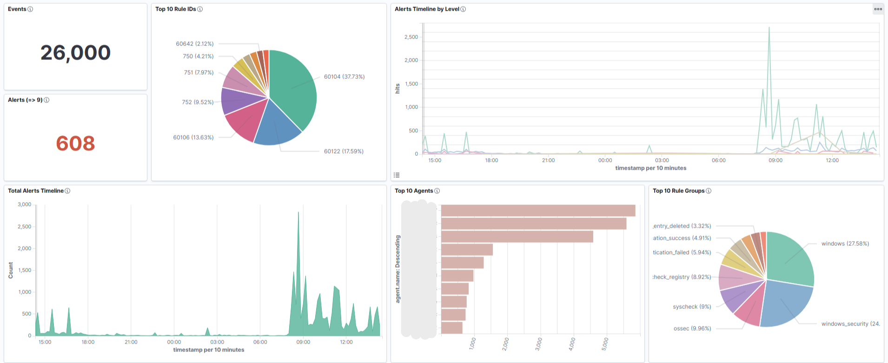
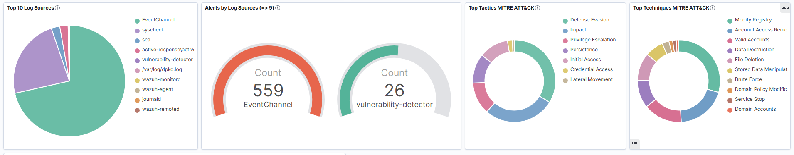
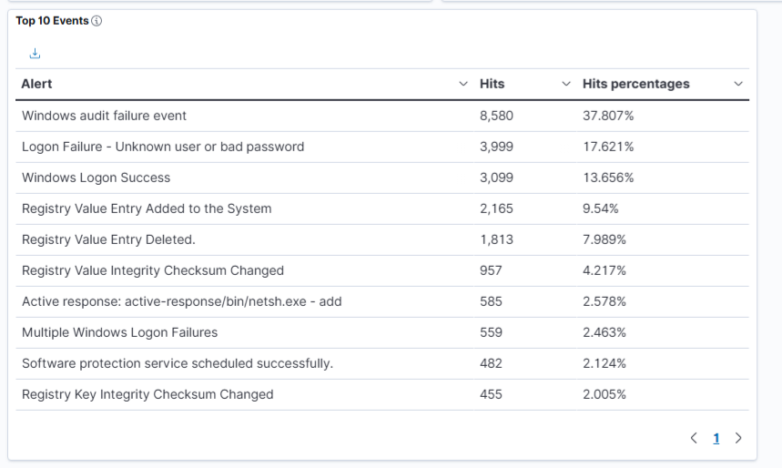

# Implementação de SOC Corporativo: Monitoramento e Defesa Ativa (Wazuh + pfSense + Shuffle SOAR)

[](https://wazuh.com)
[](https://www.pfsense.org)
[](https://shuffler.io)
[](https://github.com/MaaTPublio/implementacao-soc-corporativo)

## Sobre o Projeto

Este repositório documenta a implementação técnica e a operação de um **Security Operations Center (SOC)** em **ambiente de produção**. O projeto foi implantado para centralizar a segurança da infraestrutura corporativa, monitorando servidores e estações de trabalho reais.

O principal diferencial técnico desta implementação é o **pipeline SOAR de ponta a ponta**: o sistema detecta eventos críticos no Wazuh, orquestra os dados via Shuffle e executa o bloqueio do IP atacante diretamente na tabela de firewall do pfSense — tudo sem intervenção humana.

## Arquitetura e Tecnologias

| Componente | Tecnologia | Função |
| --- | --- | --- |
| **SIEM / XDR** | Wazuh (v4.x) | Centralização de logs, correlação de eventos e FIM em tempo real |
| **Firewall / IDS** | pfSense | Defesa de perímetro, IDS (Suricata) e bloqueio GeoIP na borda |
| **SOAR** | Shuffle | Orquestração e automação de resposta a incidentes |
| **Endpoint** | Sysmon + Wazuh Agent | Telemetria profunda de processos e rede no parque Windows |
| **Virtualização** | Hyper-V | Hospedagem da infraestrutura de segurança (Ubuntu Server) |

## Arquitetura do Ambiente


---

## Implementações de Destaque

### 1. Defesa de Perímetro (Network Security)

Configuração do **pfSense** atuando como gateway de borda da empresa:

- **IDS Suricata:** Inspeção profunda de pacotes (DPI) na interface WAN para detecção de anomalias e tentativas de intrusão.
- **pfBlockerNG:**
  - *GeoIP Blocking:* Bloqueio de conexões de países sem relação comercial (redução drástica de superfície de ataque).
  - *DNSBL:* Sinkhole para domínios maliciosos e de phishing, protegendo usuários internos.
- **Integração:** Forwarding de logs via Syslog (UDP 514) para o Wazuh Manager para correlação centralizada.

### 2. Telemetria Avançada e Tuning (Endpoint Security)

Para superar as limitações dos logs padrão do Windows, foi implementado o **Sysmon** em todo o parque:

- **Cobertura:** Criação de Processos (ID 1), Conexões de Rede (ID 3), Injeção de DLLs (ID 7) e Consultas DNS (ID 22).
- **Noiseless Approach:** Desenvolvimento de regras de whitelist agressivas para softwares corporativos em uso (ERPs, ferramentas de dev, antivírus), eliminando ruído operacional e focando a atenção em incidentes reais.

### 3. Hardening da Aplicação Web

- Implementação de **Autoridade Certificadora (CA) Interna**.
- Geração de certificados SSL/TLS próprios para o Dashboard, eliminando avisos de insegurança no navegador e protegendo credenciais administrativas.

### 4. Defesa Ativa Local (Active Response Wazuh)

Automação de resposta a incidentes de severidade crítica (Nível > 10):

- **Gatilho:** Detecção de ataques de força bruta ou scans agressivos direcionados aos servidores.
- **Ação:** Bloqueio temporário do IP atacante via firewall local (`netsh`) no Windows.
- **Segurança:** Whitelist de IPs de gestão para prevenir bloqueio acidental da equipe de TI.

### 5. Automação SOAR — Wazuh + Shuffle + pfSense

O diferencial técnico central do laboratório: um **pipeline de resposta automatizada de ponta a ponta** que detecta, orquestra e mitiga ataques sem intervenção humana.

#### 5.1 Detecção e Gatilho (Wazuh Manager)

O `integratord` do Wazuh foi configurado para acionar um webhook externo sempre que um alerta atingir **nível 10** em grupos de ataque críticos. Uma `white_list` no bloco `<global>` do `ossec.conf` protege os IPs de administração contra autobloqueio.

```xml
<!-- /var/ossec/etc/ossec.conf -->
<integration>
  <name>custom-shuffle-final</name>
  <hook_url>https://<IP_DO_SHUFFLE>:3443/api/v1/hooks/<ID_DO_WEBHOOK></hook_url>
  <level>10</level>
  <group>authentication_failures,authentication_failed,attack,sqli,xss,suricata,malware</group>
  <alert_format>json</alert_format>
</integration>
```

> O arquivo de integração segue a nomenclatura obrigatória `custom-<nome>`, com permissões `chown root:wazuh` e `chmod 750`, alocado em `/var/ossec/integrations/`. Ver: [`soar/custom-shuffle-final`](./soar/custom-shuffle-final)

#### 5.2 Orquestração (Shuffle SOAR)

O workflow no Shuffle foi configurado com os seguintes nós:

1. **Webhook Node:** Recebe o payload JSON completo do Wazuh.
2. **Condição:** Trava lógica `$exec.data.srcip != vazio` — impede que eventos internos sem IP de origem (ex: logs do Windows) disparem bloqueios.
3. **SSH Node (Shuffle Tools):** Autentica no pfSense via SSH com credenciais de root e executa o comando de bloqueio.

#### 5.3 Mitigação Ativa (pfSense)

O bloqueio não utiliza regras de firewall manuais, mas sim **tabelas alocadas em memória (Packet Filter)**. Foi criado um Alias do tipo `Host(s)` chamado `bloqueio_soar`. O Shuffle injeta o IP diretamente nessa tabela via:

```bash
/sbin/pfctl -t bloqueio_soar -T add $exec.data.srcip
```

#### 5.4 Comandos de Validação e Troubleshooting

```bash
# Exibir IPs atualmente bloqueados
pfctl -t bloqueio_soar -T show

# Limpar tabela para testes
pfctl -t bloqueio_soar -T flush

# Remover um IP específico
pfctl -t bloqueio_soar -T delete <IP>

# Simular ataque para acionar o pipeline (sem ataque de rede real)
echo "Apr  8 19:10:00 soc sshd[9999]: Failed password for root from 8.8.8.8 port 1234 ssh2" \
  | sudo tee -a /var/log/auth.log

# Monitorar a integração em tempo real
grep "custom-shuffle-final" /var/ossec/logs/ossec.log
```

---

## Estrutura dos Arquivos

```
.
├── docs/                        # Screenshots e evidências do ambiente
│   ├── dashboard.PNG
│   ├── mitre.png
│   └── top_events.PNG
├── networking/                  # Configurações de segurança de borda (pfSense)
├── soar/                        # Pipeline de automação SOAR
│   ├── custom-shuffle-final     # Script de integração Wazuh → Shuffle
│   ├── ossec-integration-snippet.xml
│   └── README.md
├── wazuh-config/                # Trechos do ossec.conf e estratégias de distribuição
└── wazuh-rules/                 # Regras XML personalizadas aplicadas em produção
```

---

## Dashboards e Evidências

### Visão Geral do SOC

Painel de operações customizado para reduzir falsos positivos. Destaque para a detecção de incidentes reais e a atuação da **Resposta Ativa** (bloqueio automático) listada no top de eventos.







> *Nota: Dados sensíveis como hostnames e IPs internos foram sanitizados para esta publicação.*

> **Créditos:** O layout deste dashboard foi adaptado do projeto [OpenSoC](https://github.com/olibavictor/OpenSoC) de Victor Oliba.

---

*Case de implementação real desenvolvido por [Mateus Publio de Oliveira](https://linkedin.com/in/mateuspublio)*
